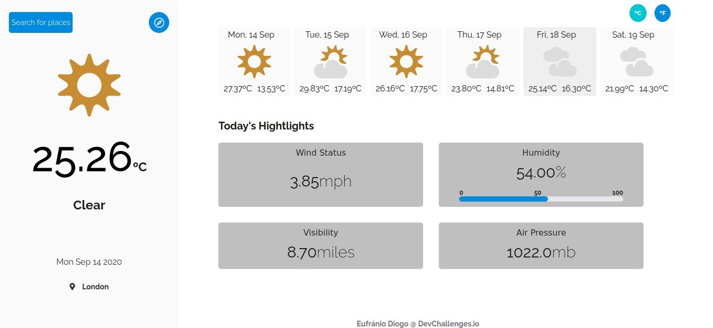

<!-- Please update value in the {}  -->

<h1 align="center">Weather App</h1>

   Solution for a challenge from  <a href="http://devchallenges.io" target="_blank">Devchallenges.io</a>.

  <h3>
    <a href="https://eufraniodiogo.github.io/Weather-App">
      Demo
    </a>
     | 
    <a href="https://github.com/EufranioDiogo/Weather-App">
      Solution
    </a>
     | 
    <a href="https://devchallenges.io/challenges/mM1UIenRhK808W8qmLWv">
      Challenge
    </a>
  </h3>

<!-- TABLE OF CONTENTS -->

## Table of Contents

- [Table of Contents](#table-of-contents)
- [Overview](#overview)
  - [Built With](#built-with)
- [Features](#features)
- [How To Use](#how-to-use)
- [Contact](#contact)

<!-- OVERVIEW -->

## Overview

Introduce your projects by taking a screenshot or a gif. Try to tell visitors a story about your project by answering:

- Where can I see your demo? 
  [Here](https://eufraniodiogo.github.io/Weather-App)
- What was your experience? 
  It was a very cool project to pratice and learn new stuff!
- What have you learned/improved? 
  I learned more about working with apis and asynchronous functions in JavaScript.

### Built With

<!-- This section should list any major frameworks that you built your project using. Here are a few examples.-->

- [Vue.js](https://vuejs.org/)
- HTML
- CSS

## Features

<!-- List the features of your application or follow the template. Don't share the figma file here :) -->

This application/site was created as a submission to a [DevChallenges](https://devchallenges.io/challenges) challenge. The [challenge](https://devchallenges.io/challenges/mM1UIenRhK808W8qmLWv) was to build an application to complete the given user stories.

## How To Use

<!-- Example: -->

Just enter in this url: <a href="https://eufraniodiogo.github.io/Weather-App" target="_blank">https://eufraniodiogo.github.io/Weather-App</a>

But if do you want take a overview at the code, do the download of it or make a fork, pay attention at the LICENSE

## Contact

- [Website](https://eufraniodiogo.github.io)
- [GitHub](https://github.com/EufranioDiogo)
- Email: eufraniodiogo5@gmail.com
